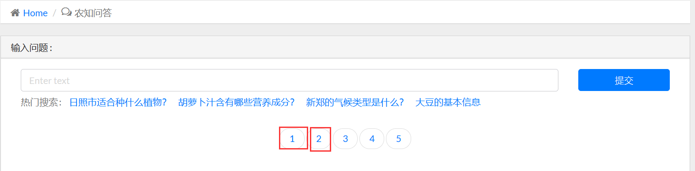

## 项目目录
├─Agri_KG_QA        django项目目录      
├─data              保存抽取出的csv文件             
├─data_process      保存有原始数据，并将所需数据抽取出来      
├─dict              保存抽取出的实体部分          
└─templates     

## 数据处理
1.  创建文件夹data和dict
2. 将csv文件夹放入data_process下，300.txt放入dict文件夹下。     
    数据提取：           
    链接：https://pan.baidu.com/s/1RpbwA-UwaHYVZimZ7-afsw?pwd=78t1             
    提取码：78t1        
   
3. 运行data_process文件夹下的main.py文件夹生成所需的知识图谱以及特征字典。(运行前请连接neo4j)

## QA
1. 运行方法：在终端输入 `python manage.py runserver`
2. 在进行问答时，需点击下方按钮，选择问答系统：

3. 目前可回答问题：
    1. <地点>适合种植什么？
    2. <地点>属于哪种气候？
    3. <作物>有那些营养元素？
    4. <作物>的基本信息？
    note: 由于数据不够完善，难免有没有答案的情况，这是改进的方向。